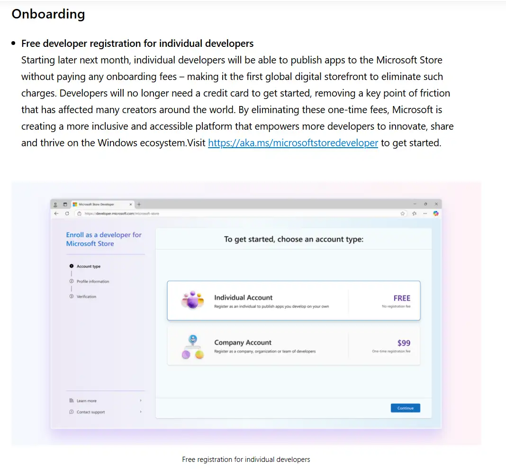

<!--
title: 如何免费上架微软应用商店
date: 2025-05-29
description: 完全免费！无需对象存储!无需代码签名!
thumbnail: blogs/Images/Microsoft_store_submission_guide.webp
tags: [Microsoft Store]
-->

## 微软召开build2025开发者大会宣布从2025年5月份起Microsoft store将对个人开发者免费

正好这些天将[Catime](https://github.com/vladelaina/Catime)上架到了Microsoft store，发现这个流程巨简单，只需要填一下表就行，最重要的是完全免费!

<iframe src="//player.bilibili.com/player.html?isOutside=true&aid=114567078215883&bvid=BV1KWjMzoEFS&cid=30141056368&p=1" scrolling="no" border="0" frameborder="no" framespacing="0" allowfullscreen="true"></iframe>

> 视频教程安排上啦，因为讲起来实在比文字清楚太多啦～

链接：

​	[Microsoft 合作伙伴中心](https://partner.microsoft.com/zh-cn/dashboard/home)

​	[Catime_Microsoft_Store](https://apps.microsoft.com/detail/9n3mzdf1z34v)

​		
